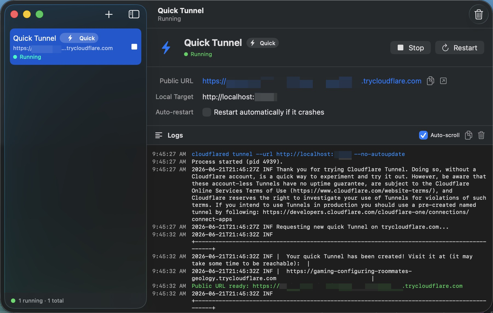
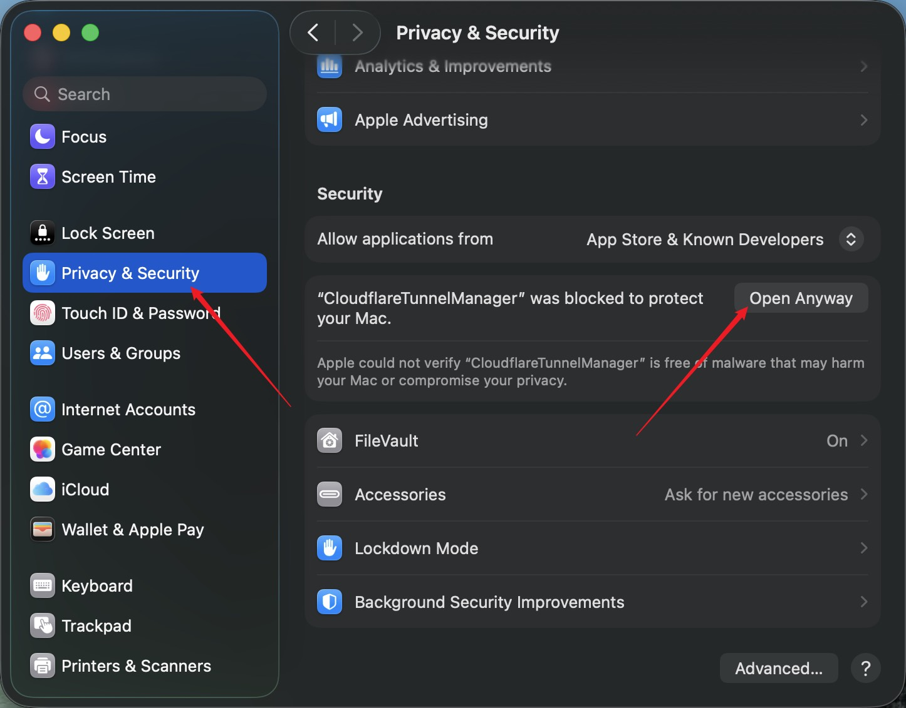

# ☁️ Cloudflare Tunnel Manager

A native **macOS** app to expose `localhost` to the internet — an **ngrok-style UI** for [Cloudflare Tunnel](https://developers.cloudflare.com/cloudflare-one/connections/connect-networks/), backed by Cloudflare instead of a paid SaaS.


### ⬇️ [**Download the latest `.dmg`**](https://github.com/lisenhuang/CloudflareTunnelManager/releases/latest/download/CloudflareTunnelManager.dmg)

Always the newest build → open it → drag the app into **Applications**.



---

## ✨ Features

| | |
|---|---|
| 📋 **Dashboard** | every tunnel with live status, local target & public URL |
| 🪄 **One-click create** | Quick or Named — tunnel + ingress + DNS done for you |
| ⏯️ **Process control** | start / stop / restart, auto-restart with backoff |
| 📜 **Live logs** | per-tunnel, color-coded, copyable |
| 🧭 **Menu-bar** | start/stop & copy-URL without the main window |
| 🔐 **Keychain** | API & connector tokens never touch disk |

---

## ⚡️ Quick vs 🌐 Named tunnels

```
⚡️ Quick   localhost:3000 ──cloudflared──▶  random.trycloudflare.com   no account · dies on stop
🌐 Named   localhost:3000 ──cloudflared──▶  app.your-domain.com        your domain · permanent
```

| | ⚡️ Quick | 🌐 Named |
|---|---|---|
| URL | random `*.trycloudflare.com` | your `app.example.com` |
| Cloudflare account | ❌ not needed | ✅ required |
| Auth | none | scoped **API token** |
| Lifetime | ephemeral (new URL each restart) | persistent / reusable |
| Best for | quick demos, webhooks | stable dev/staging URLs |

> 💡 **Quick** is the true ngrok replacement: zero config, instant URL. The URL **changes on every restart** — switch to a **Named** tunnel when you need a stable address.

---

## 🚀 Install

1. ⬇️ **[Download the `.dmg`](https://github.com/lisenhuang/CloudflareTunnelManager/releases/latest/download/CloudflareTunnelManager.dmg)** → open → drag to **Applications**.
2. Needs [`cloudflared`](https://github.com/cloudflare/cloudflared) — the app offers a one-click `brew install` if it's missing.

> ⚠️ **First launch on an unsigned build** — macOS Gatekeeper blocks it once. Allow it via **System Settings → Privacy & Security → “Open Anyway”** (or right-click the app → **Open**, or run `xattr -dr com.apple.quarantine "/Applications/CloudflareTunnelManager.app"`).



---

## 🛠️ Build from source

```bash
swift run                 # dev run
./scripts/make-app.sh     # → CloudflareTunnelManager.app
open Package.swift        # open in Xcode
```

Requires **macOS 14+** and the **Swift 6** toolchain (Xcode 16).

---

## 📦 Releases — automated (GitHub Actions)

| Workflow | Trigger | Does |
|---|---|---|
| **CI** | push / PR → `main` | build + verify the `.app` assembles |
| **Release** | push tag `v*` | universal build → `.dmg` + `.zip` → GitHub Release |

```bash
git tag v0.1.1 && git push origin v0.1.1   # builds & publishes a release
```

🔗 **Permanent latest-download link** (each release also ships version-less copies):

```
https://github.com/lisenhuang/CloudflareTunnelManager/releases/latest/download/CloudflareTunnelManager.dmg
```

<details>
<summary>🔏 <b>Signed & notarized builds</b> (optional — for double-click-to-run downloads)</summary>

Add these repo secrets (**Settings → Secrets and variables → Actions**) — needs an [Apple Developer Program](https://developer.apple.com/programs/) membership. **All-or-nothing**: set every secret or none (the workflow fails fast on a partial set).

| Secret | Value |
|---|---|
| `MACOS_CERTIFICATE` | base64 of your Developer ID `.p12` |
| `MACOS_CERTIFICATE_PWD` | its password |
| `MACOS_CODESIGN_IDENTITY` | `Developer ID Application: Name (TEAMID)` |
| `MACOS_NOTARY_APPLE_ID` | Apple ID email |
| `MACOS_NOTARY_TEAM_ID` | 10-char Team ID |
| `MACOS_NOTARY_PWD` | [app-specific password](https://support.apple.com/en-us/102654) |

Without them you still get a working **ad-hoc** build (the Gatekeeper step above).

</details>

---

## 🔑 API token (Named tunnels only)

**dash.cloudflare.com → My Profile → API Tokens**, scoped to:

`Account · Cloudflare Tunnel · Edit`  ・  `Zone · DNS · Edit`  ・  `Zone · Zone · Read`

Paste it into **Settings → Account** — verified against `/user/tokens/verify` and stored in the Keychain.

---

## 🏗️ Architecture

```
SwiftUI Views
     │ observe
     ▼
  AppState ──────── @MainActor @Observable orchestrator
     ├─ CloudflaredProcessService   spawn & supervise cloudflared, stream logs
     ├─ CloudflareAPIClient         REST: tunnels · ingress · DNS routes
     ├─ KeychainStore               API + connector tokens (Security framework)
     ├─ TunnelStore                 JSON persistence (Application Support)
     ├─ InstallationService         detect / brew-install cloudflared
     ├─ BinaryLocator               find cloudflared (GUI apps don't inherit PATH)
     └─ LogStore                    per-tunnel ring buffer
```

<details>
<summary>What runs which command</summary>

- **Quick:** `cloudflared tunnel --url http://localhost:PORT --no-autoupdate` → parses the `*.trycloudflare.com` URL from output.
- **Named create:** `POST /accounts/{id}/cfd_tunnel` → fetch connector token → `PUT …/configurations` (ingress) → `POST /zones/{id}/dns_records` (CNAME → `<id>.cfargotunnel.com`).
- **Named run:** `cloudflared tunnel run --token <token> --no-autoupdate` — no local cert/credentials file.

</details>

---

## 🔒 Security

- 🔐 Tokens live **only in the Keychain**; non-secret config in `~/Library/Application Support/CloudflareTunnelManager/`. `.gitignore` blocks `*.pem`, `.env`, `*.p12`, etc.
- 📦 **App Sandbox is off** (required to spawn `cloudflared`) → distributed as a **Developer ID-notarized** app, not via the Mac App Store.

## 🗺️ Roadmap

- [ ] Persist & restore running tunnels on launch
- [ ] `cloudflared` version-update prompts
- [ ] Multiple hostnames per tunnel in the UI
